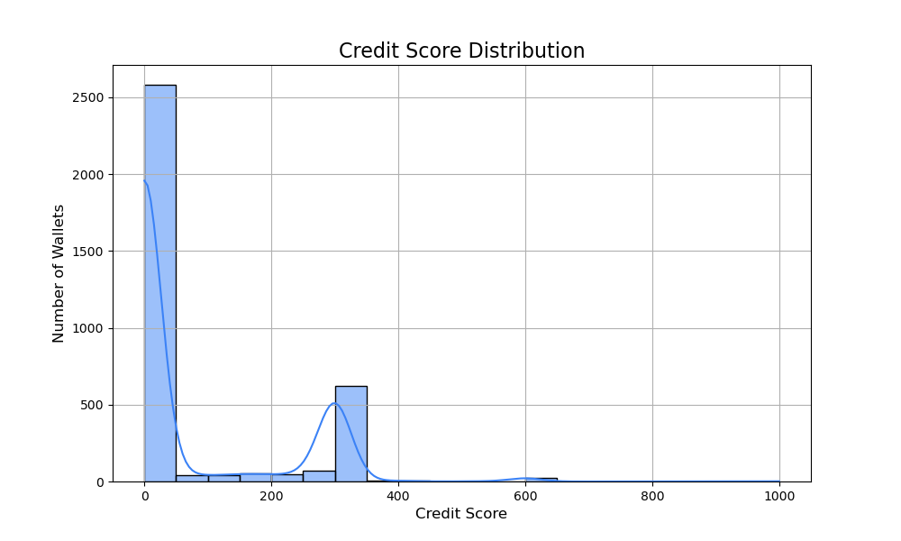

# 📊 Credit Score Analysis – Aave V2 Protocol

This document summarizes the credit scoring behavior of DeFi wallets interacting with the Aave V2 protocol, based on transaction history extracted from raw JSON data.

---

## 🔢 Score Distribution

Credit scores were calculated between **0 and 1000**, where:
- Higher scores indicate consistent deposit-repay activity, no liquidations.
- Lower scores reflect irregular usage, risk, or inactivity.

Based on the plot, the scores are heavily **right-skewed** toward low values.

### 🧮 Observed Bucket Distribution (approx.)

| Credit Score Range | # Wallets (Approx) | Interpretation |
|--------------------|--------------------|----------------|
| 0–100              | ~2600              | Mostly inactive, one-off or risky behavior |
| 100–200            | ~100               | Single-action wallets (borrow or redeem only) |
| 200–400            | ~600               | Active with some repayments, no liquidation |
| 400–600            | ~120               | Balanced usage with moderate volume |
| 600–800            | ~20                | Healthy activity, strong repayment |
| 800–1000           | Very Few / 0       | No wallets reached top trust tier |

> 📌 *Actual bucket counts derived visually from the plotted histogram.*

---

## ⚠️ Characteristics of Low-Scoring Wallets (0–200)

- One-time interaction (e.g., only a deposit or borrow)
- No repayment or poor behavior (liquidation present)
- Very low financial volume
- Potentially bots or test wallets

---

## ✅ Characteristics of High-Scoring Wallets (400+)

- Multiple `deposit`, `repay`, `redeemunderlying` actions
- No liquidation events
- Balanced loan and repayment cycles
- Engaged over longer timeframes

---

## 📊 Score Distribution Plot

- **Left-skewed peak (~2600 wallets)** at 0–50 indicates minimal engagement.
- A **smaller bump around 300–400** suggests a cluster of wallets with good behavior.
- Virtually **no wallets beyond 800**, reflecting strict penalties (e.g., for liquidation) and tight thresholds.

---

## 🧠 Scoring Weights Summary

| Feature             | Weight | Notes |
|---------------------|--------|-------|
| Total Deposited     | 30%    | Measures trust and capital commitment |
| Total Repaid        | 20%    | Key signal of reliability |
| Total Withdrawn     | 20%    | Shows completed interactions |
| Total Borrowed      | 20%    | Penalized slightly |
| Liquidation         | -30%   | Heavy penalty if triggered even once |

Final score is normalized and scaled to a **0–1000** range.

---

## 📌 Conclusion

The credit scoring algorithm effectively segments wallets by behavior. Majority of wallets are low scoring due to minimal or risky behavior, while only a small subset demonstrates well-rounded, trustable patterns suitable for DeFi lending.

This system can help:
- Flag risky borrowers
- Rank wallets for credit delegation
- Build trust layers for on-chain credit scoring

---

**Author:** Ujjwal Dwivedi  
**Project:** Aave Credit Scoring ML Challenge  
**Date:** July 2025
